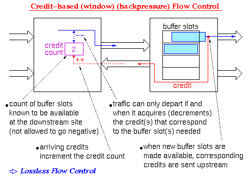
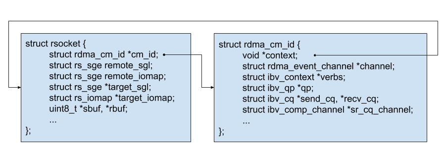
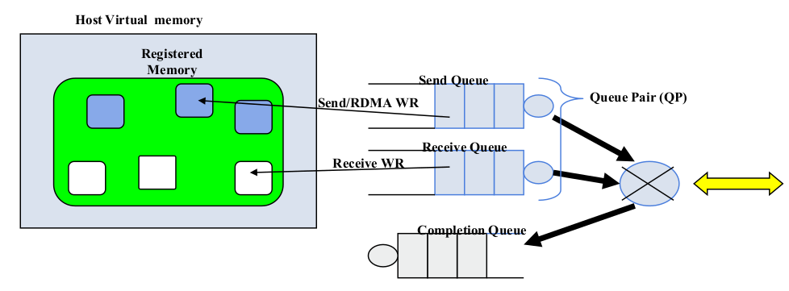
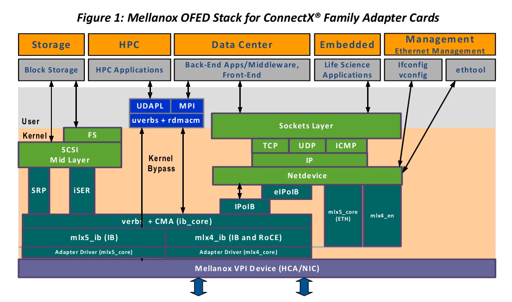
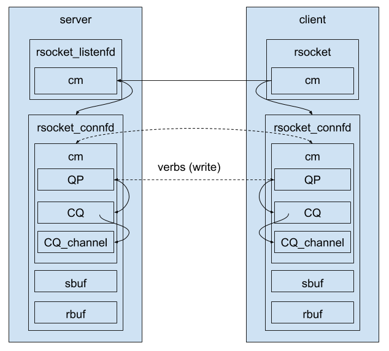
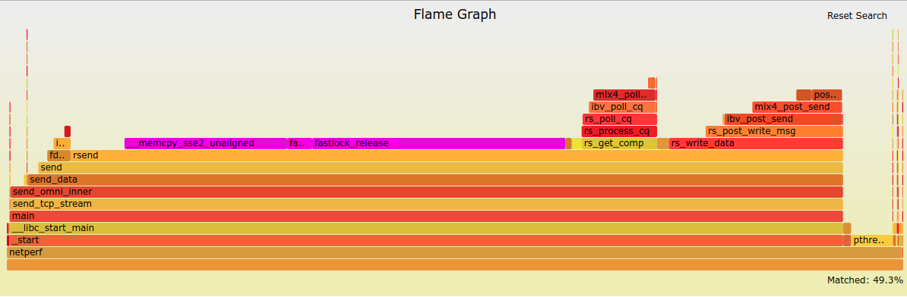
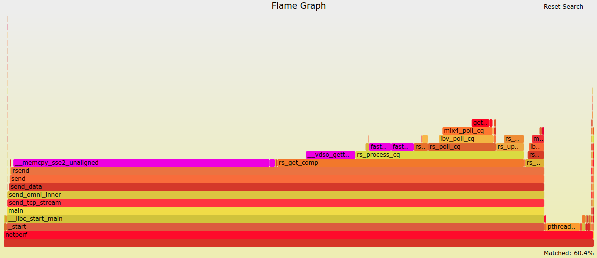
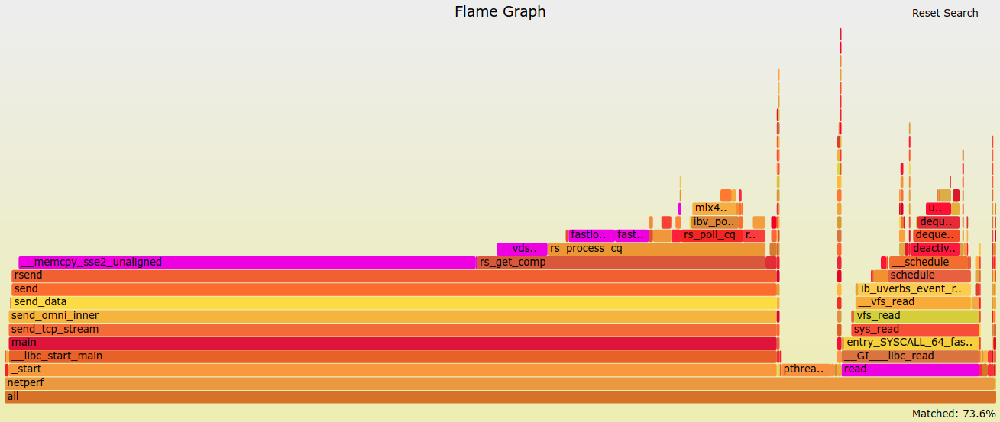
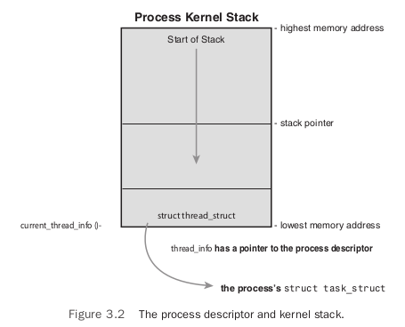

## Understanding Rsocket

文章从以下几个方面深入理解 rsocket 转换库，首先是 rsockets 协议和实现概揽，然后是 rsocket 内部实现细节和 API 兼容性分析，最后通过一些 benchmarks 给出 rsocket 的性能问题并尝试改进。

## Rsocket protocol and design guide

### Data streaming (TCP) overview

Rsockets 是在 RDMA 之上的协议，为应用提供 socket-level 的编程接口，其具体实现为 rsocket。这里，我将介绍 rsockets 协议、rsocket 的设计和实现细节。

Rsockets 使用 RDMA write with immediate data 在节点间传输数据，payload 为用户数据（user data），而 immediate data 为内部消息（e.g. Data Transfer、Credit Update、Iomap Updated、Control 之 DISCONNECT 和 Control 之 SHUTDOWN）。Rsockets 在发送方维护了一个 segments 列表（target SGL），每一个 entry（SGE）引用了接受方的一个空闲缓冲区（receive buffer），这样 RDMA write 就知道将数据写入到哪些缓冲区中。同时，rsockets 会在接受方维护一个 remote SGL 来指向 target SGL，这样当接受方有空闲 receive buffers 时，可以通过 RDMA write 修改主机 A 上的 SGL 以注册这些 buffers。设主机 A 是发送方，主机 B 是接受方，以上过程如图，

```
   host A                   host B
                          remote SGL                      
  target SGL  <-------------  [  ]
     [  ] ------
     [  ] --    ------   receive buffer(s)         
            --        ----->  +--+
              --              |  |
                --            |  |
                  --          |  |
                    --        +--+
                      --       
                        --->  +--+
                              |  |
                              |  |
                              +--+
```

主机 B 中的 remote SGL 包含了 target SGL 的地址、大小和 rkey。当主机 B 上有空闲的缓冲区时，rsockets 通过 RDMA write 将其信息写入到 target SGL 的某个 entry 中（SGE）。同时，RDMA write 还会携带一个 immediate data 告诉主机 A 其 target SGL 已被更新。

当主机 A 需要发送数据时，先检查它的 target SGL。当前的 SGE 指向主机 B 上的 next 接受缓冲区。如果需要传输的数据小于接受缓冲区，主机 A 将更新 SGE 以显示剩下的可用空间。也就是说，在一个缓冲区被写完之后才会写下一个。同时，RDMA write 携带一个 immediate data 告诉主机 B 有新数据到达。

Rsockets 依赖 immediate data 向远端进行事件通知，包括「数据已传送」和「target SGL 已更新」。因为 immediate data 需要远端在相应 QP 中先 post 一个 receive request 来接受之，所以 rsockets 使用 credit-based flow control mechanism 来进行流控。Credit 的个数由接受队列的大小决定并在连接建立时交换。如果要传输应用数据，rsockets 要求发送方必须同时拥有可用的 credits 和 receive buffer。

Credit-based flow control mechanism 在发送方维护一个计数器，记录了接受方 available buffer slots 的个数。当连接建立时，两端会交换 credits，其值由接受队列的大小决定。当发送方需要发送数据时，先 check credits 是否可用（credits >= 0），可用再发数据然后将 credits 减一。接受方处处理完一个 buffer slots 后将 credits 加一。Rsockets 中，credits 表示 QP 中 receive request 的个数。



因为 immediate data 限制在 4 字节，所以携带的信息要么是显示已传输数据的大小（bytes），要么是 internal messages，不能是两者。为了避免 credit 死锁，rsockets 保留少量 available credits 仅用于控制信息的传输，同时协议依赖 RNR NAKs 和 retries 来按序执行。

### Connection establishment

Rsockets 使用 RDMA CM 建链。链接建立的时候会交换 struct rs_conn_data。rs_conn_data 包括 rsocket 协议版本（目前只有 1）、用于区分大小端的 RS_CONN_FLAG_NET、receive credits 初始时的个数、target SGL 信息和第一个 data buffer 信息。其中，SGL 指向的缓冲区是一个 SGE 数组，一个 SGE 描述了一个接受缓冲区，通信两边都会保存这一个 SGL，发送方由 target SGL 保存，接受方由 remote SGL 保存。

```
struct rs_sge {
	uint64_t addr;
	uint32_t key;
	uint32_t length;
};

#define RS_CONN_FLAG_NET 1

struct rs_conn_data {
	uint8_t		  version;
	uint8_t		  flags;
	uint16_t	  credits;
	uint32_t	  reserved2;
	struct rs_sge target_sgl;
	struct rs_sge data_buf;
};

Version - current version is 1
Flags
RS_CONN_FLAG_NET - Set to 1 if host is big Endian.
                   Determines byte ordering for RDMA write messages
Credits - number of initial receive credits
Reserved2 - set to 0
Target SGL - Address, size (# entries), and rkey of target SGL.
             Remote side will copy this into their remote SGL.
Data Buffer - Initial receive buffer address, size (in bytes), and rkey.
              Remote side will copy this into their first target SGE.
```

### Message format

Rsockets 使用带 immediate data 的 RDMA write 进行消息（messages）传递。如果仅仅传递 messages，RDMA write payload 的长度会置为 0，同时 immediate data 的长度限制为 4 字节。Rsockets 定义了如下的消息类型，

```
Bits    Message             Meaning of
31:29    Type               Bits 28:0
000    Data Transfer     bytes transfered
001    reserved
010    reserved - used internally, available for future use
011    reserved
100    Credit Update     received credits granted
101    reserved
110    Iomap Updated     index of updated entry
111    Control           control message type
```

#### Data transfer

说明应用数据已经写入到指定的接受缓冲区（next available receive buffer），所传输数据的大小（bytes）记录在 message[28:0]，可知最大能够传输的数据为 256 MB。

#### Credit update

说明更新了 target SGL 和 credits。当 message[28:0] 为零时，该信息仅用于表示 SGL 已更新。当 message[28:0] 非零时，message[28:0] 为新可用 credits（additional credits）的个数。同时，消息接受者需要通过检查 SGL 的内容来判断 SGL 是否有更新。当远端的 target SGL 被使用时，不能修改它，判定的方法是检查本地的缓冲区是否被填充满。

#### Iomap updated

用于显示 target iomap 的某个 entry 已更新。更新的 entry 包含了 offset、address、length 和 rkey。一旦 iomap 被更新，本地的应用直接将数据写入到相应的接受缓冲中，该过程没有任何拷贝（direct I/O）。

#### Control message - DISCONNECT

显示该 rsocket 连接已经完全断开，意思再也不会收发数据了。当然，这之前收到的数据仍然是可读的。

#### Control message - SHUTDOWN

显示该 rsocket 的远端关闭了 send。接受到 shutdown 消息后，应用不再接受数据，但仍能发送数据。

### Iomapped buffers

基于 iomapped 的缓冲方式，rsockets 支持零拷贝数据传输，当然这需要应用使用特定的接口。Iomapped buffers 的管理和普通缓冲区的管理一致。

```
   host A                   host B
                          remote iomap                      
  target iomap  <-----------  [  ]
     [  ] ------
     [  ] --    ------  iomapped buffer(s)         
            --        ----->  +--+
              --              |  |
                --            |  |
                  --          |  |
                    --        +--+
                      --       
                        --->  +--+
                              |  |
                              |  |
                              +--+
```

主机 B 上的 remote iomap 包含了 target iomap 的地址、大小和 rkey。当主机 B 上的应用程序将接受缓冲区提交给给定的 rsocket 时，rsockets 使用 RDMA write 将该 buffer 的信息写入到主机 A 上 target iomap 中的某个 entry 中（该 entry 保存了主机 B 上相应接受缓冲的地址、大小和 rkey）。同时，该次 RDMA write 携带的 immediate data 将告诉主机 A 其 target iomap 已更新。当主机 A 需要发送数据时，先通过其 target iomap 找到相应的接受缓冲区，然后将数据 RDMA send/write 到指定缓冲中。

### Datagram overview

Rsocket API 支持 datagram sockets，其协议和实现均和之前的方式不同。相比 connected rsockets，datagram sockets 没必要绑定一个 IP 地址，而是可以选择主机上任意一个 IP 地址，即使该 IP 所在的 RDMA 设备是其它设备。所以，一个 datagram socket 应该支持多个 RDMA 设备和端口，同时一个 datagram socket 关联一个 UDP socket 和 0 个或者若干个 UD QPs。

Rsockets 会在用户数据之前添加特定的 headers，以此来解析远程 UD QP numbers。当应用程序第一次向某个地址（IP and UDP port）发送一个 datagram 时，rsocket UDP 的工作过程如下：

1. 将目的地址（dst_IP, dst_UDP_port）存储到一个 lookup table 中；
2. 找一个本地可用的网络地址（src_IP, src_UDP_port）；
3. 在 RDMA 设备上分配一个 UD QP 并构造一个 header（src_IP, src_UDP_port, QPN）prepend 到用户数据之前；
4. 查表看有没有 UD QPs 可用，否则使用 UDP socket 将该 datagram 发给远端；
5. 接收侧会有一个服务线程（service thread）来处理 UDP socket 上的消息。该线程将 header 提取出的元组（src_IP, src_UDP_port, QPN）更新到 lookup table 中。可以猜测，一旦路径信息被解析，两节点间的 datagram 通信会使用 UD QPs 进行。

### UDP message format

Rsockets 首先在 UDP sockets 的基础上传递一些消息（messages）来解析远程 QPN。当某个用户程序想向远端发送一个 datagram 但未配置远端的 UP QP，该 datagram 会通过 UDP socket 发送，datagram 之前还会添加如下的 header，

```
struct ds_udp_header {
	uint32_t	  tag;
	uint8_t		  version;
	uint8_t		  op;
	uint8_t		  length;
	uint8_t		  reserved;
	uint32_t	  qpn;  /* lower 8-bits reserved */
	union {
		uint32_t  ipv4;
		uint8_t   ipv6[16];
	} addr;
};

Tag - Marker used to help identify that the UDP header is present.
#define DS_UDP_TAG 0x55555555

Version - IP address version, either 4 or 6
Op - Indicates message type, used to control the receiver's operation.
     Valid operations are RS_OP_DATA and RS_OP_CTRL.  Data messages
     carry user data, while control messages are used to reply with the
     local QP number.
Length - Size of the UDP header.
QPN - UD QP number associated with sender's IP address and port.
      The sender's address and port is extracted from the received UDP
      datagram.
Addr - Target IP address of the sent datagram.
```

一旦远端的 QP 信息被解析，消息将直接通过 UD QPs 进行传递。使用 UD QP 进行数据传输时，用户数据之前会添加如下的 header，

```
struct ds_header {
	uint8_t		     version;
	uint8_t		     length;
	uint16_t	     port;
	union {
		uint32_t     ipv4;
		struct {
			uint32_t flowinfo;
			uint8_t  addr[16];
		} ipv6;
	} addr;
};

Verion - IP address version
Length - Size of the header
Port - Associated source address UDP port
Addr - Associated source IP address 
```

### Refs

- Rsocket protocol and design guide. https://github.com/linux-rdma/rdma-core/blob/master/librdmacm/docs/rsocket.
- Basic flow control for RDMA transfers. https://thegeekinthecorner.wordpress.com/2012/12/19/basic-flow-control-for-rdma-transfers/.

##Implementation details

**Rsocket 中类 socket 的结构体是 rsocket，其维护了所有的资源。另外，rsocket 使用 rdma_cm 进行连接管理，使用 ibverbs 进行数据传输。**当用户通过 rsocket 创建一个 rsocket 实例时，首先通过 rdma_cm 创建一个 rdma_cm_id 并存储在 cm_id 中，然后创建并维护收发缓冲区。rdma_cm 实现了类 socket 语义的连接建立和管理过程，其中 rdma_cm_id 想当于一个 socket，其结构如下，

```
struct ibv_context {
    struct ibv_device        *device;
    struct ibv_context_ops   ops;
    int                      cmd_fd;
    int                      async_fd;
    int                      num_com_vector;
    pthread_mutex_t          mutex;
    void                     *abi_compact;
};

enum rdma_cm_event_type {
	RDMA_CM_EVENT_ADDR_RESOLVED,
	RDMA_CM_EVENT_ADDR_ERROR,
	RDMA_CM_EVENT_ROUTE_RESOLVED,
	RDMA_CM_EVENT_ROUTE_ERROR,
	RDMA_CM_EVENT_CONNECT_REQUEST,
	RDMA_CM_EVENT_CONNECT_RESPONSE,
	RDMA_CM_EVENT_CONNECT_ERROR,
	RDMA_CM_EVENT_UNREACHABLE,
	RDMA_CM_EVENT_REJECTED,
	RDMA_CM_EVENT_ESTABLISHED,
	RDMA_CM_EVENT_DISCONNECTED,
	RDMA_CM_EVENT_DEVICE_REMOVAL,
	RDMA_CM_EVENT_MULTICAST_JOIN,
	RDMA_CM_EVENT_MULTICAST_ERROR,
	RDMA_CM_EVENT_ADDR_CHANGE,
	RDMA_CM_EVENT_TIMEWAIT_EXIT
};

struct rdma_cm_id {
	// verbs = ibv_open_device(devices);
	//	-> verbs->cmd_fd = open("/dev/infiniband/uverbs0");
	struct ibv_context			*verbs;
	// channel = rdma_cm_create_event_channel();
	// 	-> channel->fd = open("/dev/infiniband/rdma_cm");
	struct rdma_event_channel 	*channel;
	// context = rs_alloc(NULL, TCP_STREAM);
	void						*context;
	struct ibv_qp				*qp;
	struct rdma_route	 		route;
	// RDMA_PS_TCP/UDP/IBOIP/IB
	enum rdma_port_space	 	ps;
	uint8_t			 			port_num;
	// Placeholder for RDMA CM events like defs above.
	struct rdma_cm_event		*event;
	// send_cq_channel = recv_cq_channel = ibv_create_comp_channel(verbs)
	struct ibv_comp_channel 	*send_cq_channel;
	// send_cq = recv_cq = ibv_create_cq(verbs);
	struct ibv_cq				*send_cq;
	struct ibv_comp_channel 	*recv_cq_channel;
	struct ibv_cq				*recv_cq;
	struct ibv_srq				*srq;
	// pd = ibv_create_pd(verbs);
	struct ibv_pd				*pd;
	// RDMA_PS_TCP => IBV_QPT_RC, RDMA_PS_UDP/IBOIP => IB_QPT_UC
	enum ibv_qp_type			qp_type;
};
```

`struct rdma_cm_id` 结构中的资源主要分为两类，一类源自 RDMA CM，包括 rdma_event_channel、rdma_router、rdma_port_space 和 rdma_cm_event。另一类源自 ibverbs，包括 ibv_context、port_num、QP、CQ、SRQ、qp_type、send/recv_cq_channel 和 PD。RDMA CM 中的 event channel 为 /dev/infiniband/rdma_cm 的描述符，通过它可以获取 RDMA CM 定义的事件，同时 event 是一个 placeholder。ibv_context 保存了已打开的 verbs device。其中，我们通过 cmd_fd 和 verbs device 进行交互。另外，CQ channel 用于传递 CQ 事件，用法参见 https://linux.die.net/man/3/ibv_get_cq_event。

rsocket 中 `struct rsocket` 和 `struct rdma_cm_id` 的关系如下， 



ibverbs 编程模型是怎样的呢？如下图，使用 ibverbs 进行数据传输的时候，用户程序先将 WR 放入 QP（RDMA SEND/READ/WRITE WR 放入 send queue 中，而 RDMA RECV 放入到 recv queue）中，然后 verbs device 处理请求并将结果放入到 CQ 中，最后由程序 poll CQ 或者通过 CQ event notification 从 CQ 中取回 verbs device 处理的结果。

ibverbs 中 CQ event 是如何实现的呢？因为 event 是 CPU 被动接受消息，所以本质上是依靠中断构建事件通知机制，但整个过程涉及很多模块，所以有必要对 OFED 整个软件栈有一些了解。根据 OFED Linux User Manual，OFED 的软件栈如下。因为 rsocket 基于 uverbs 和 rdmacm 实现，所以我们重点关注 ib_uverbs、rdma_cm、ib_core、mlx4_ib 和 mlx4_core。用户使用 event-driven 的方式获取 CQ event 的过程：ibv_get_cq_event() -> ib_uverbs_event_read，然后 ib_uverbs_event_read 和 driver 交互获得事件，最后 driver routine 和 HCA 之间的交互模型就是通过 HCA 中断实现。P.S. ibv_get_cq_event 会造成上下文切换，当数据超过 64KB 时，使用 perf 对 netperf 进行 breakdown 发现 CQ event 开销占 14.2%。



HCA 支持多种产生中断的方法——asserting a pin on its physical interface, emulating interrupt ping assertion on the host link (PCI) or generating Message Signaled Interrupts (MSI/MSI-X)，使软件能够将中断复用到主机上不同的 consumers。每个 EQ 都可以配置为在 EQE 发布到该 EQ 时产生中断。多个 EQs 可以映射到同一个中断向量（MSI-X)，从而在 EQ 和 interrupts 之间保持了多对一的关系。WQs、CQs、EQs 和 MSI-X vectors 之间的关系如图，


rsocket 提供的编程接口包括，

```
rsocket
rbind, rlisten, raccept, rconnect
rshutdown, rclose
rrecv, rrecvfrom, rrecvmsg, rread, rreadv
rsend, rsendto, rsendmsg, rwrite, rwritev
rpoll, rselect
rgetpeername, rgetsockname
rsetsockopt, rgetsockopt, rfcntl
riomap, riounmap, riowrite
```

rsocket 调用就是创建一个 `struct rsocket` 实例 rs 和一个 cm 实例，其维护了通信所需要的资源。rs 分配时初始化了一些变量，其默认值如下，

```
rs->sbuf_size = def_wmem;	// 1 << 17, 128 KB
rs->rbuf_size = def_mem;	// 1 << 17, 128 KB
rs->sq_inline = def_inline;	// 64 Bytes
rs->sq_size = def_sqsize;	// 384
rs->rq_size = def_rqsize;	// 384
rs->ctrl_max_seqno = RS_QP_CTRL_SIZE;	// 4
rs->target_iomap_size = def_iomap_size;	// 0
```

rbind 和 rlisten 分别直接调用 rdma_bind 和 rdma_listen。

raccept 调用：

1. rs_alloc 分配一个新的 new_rs；
2. 调用 rdma_get_request 从 rs 捕获一个 connection 并保存在 new_rs->cm_id 中，然后关联 new_rs 和 cm_id->channel_fd，最后提取 rs_conn_data ；
3. 调用 rs_create_ep 分配 endpoint 所需要的资源，过程参见 rconnect 中的注释，如下图；
4. 先保存收到 rs_conn_data 再构造 rs_conn_data 并在调用 rdma_accept 时候返回； 



rconnect 调用主要通过 rs_do_connect 建立连接。rs_do_connect 的过程如下：

1. 先后调用 rdma_resolve_addr 和 rdma_resolve_route 进行 dst addr 和路由的解析；
2. 调用 rs_create_ep 创建端点所需要的资源，包括：
   1. 调用 rs_create_cq 创建 cq，send/recv_cq 共享同一个 cq 和 cq_channel；
   2. 调用 rdma_create_qp 创建 qp，context 指向当前的 rs、类型为 IBV_QPT_RC、sq_sig_all 为 true（没一个提交的 wr 都对应一个 wc）、max_send_sge 为 2、max_recv_sge 为 1、max_inline_data 为 sq_inline（默认 64 字节）；
   3. 调用 rs_init_bufs 初始化一些缓冲区，
      1. sbuf，大小为 sbuf_size（128KB），若 ctrl msg 不能 inline，则在 sbuf 后面追加 RS_MAX_CTRL_MSG（sizeof rs_sge）× RS_QP_CTRL_SIZE（4）大小的缓冲用于保存待发送的控制消息。另外，sbuf 由 ssgl 维护，sge 个数为 2；
      2. target_sgl 和 target_iomap 连在一起，target_sgl 初始时有两个 sge，target_iomap 初始时 sge 的 个数由用户指定（rsetsockopt(SOL_RDMA, RDMA_IOMAPSIZE, whatever_size, ...) or echo whatever_size > /etc/rdma/rsocket/iomap_size）；
      3. rbuf，大小为 rbuf_size（128KB），若 RS_OPT_MSG_SEND 开启，则在 rbuf 后追加 rq_size × RS_MSG_SIZE（sizeof uint32）的空间用于保存 messages；
      4. rbuf_free_offset 和 rbuf_bytes_avail 分别取 rbuf_size 一半（因为第一次交换的 data_buf 为 rbuf 的一半，即 64KB），sqe_avail 为 sq_size - ctrl_max_seqno，而 rseq_comp 取 rq_size 一半；
3. 调用 rdma_connect 建链并交换连接数据（rs_conn_data），包括 credits 个数（rq_size）、target _iomap_size、target_sgl 和 data_buf。本地将远端的 target_sgl 保存在 remote_sgl 中，因为远端的 target_iomap 就在 target_sgl 后面，所以其 addr 可以通过 remote_sgl.addr + sizeof(remote_sgl) * remote_sgl.length 计算得到。另外，data_buf 保存在 target_sgl[0] 中，大小为 64KB。Credits 个数保存在 sseq_comp 中，其个数为 rq_size（默认 384）。

rsend 调用流程如下：

1. 如果是 SOCK_DGRAM 调用 dsend 进行数据传送，否则进入 TCP_STREAM 的例程，若没建连则建立连接；
2. 调用 rs_can_send 检查是否能发送数据，不能则调用 rs_get_comp 处理 CQ 以释放资源，否则继续；
   1. rs_get_comp 调用 rs_process_cq 处理 CQ 然后调用 rs_update_credits 更新远端的 credits 和 target_sgl。
3. 调整 xfer_size 适合 sbuf_bytes_avail 和 recv_bytes_avail，然后能 inline 则直接 inline，否则先拷贝到 sbuf，再调用 rs_write_data 进行数据传送。

rrecv 调用过程如下：

1. 如果是 SOCK_DGRAM 则调用 ds_recvfrom 收包，否则转 TCP_STREAM 例程，若没建链则建立连接；
2. 调用 rs_have_rdata 检查 rbuf 中是否有数据，否则调用 rs_get_comp 处理事件；
3. 将数据从 rbuf 拷贝到用户指定的 buf 中，完了直接返回。

### Summary

rsocket 使用 rdma_cm 进行连接管理，使用 ibverbs 进行数据传送。rsocket 使用 rdma_cm 建立连接的过程很简单，每一个 rsocket instance 对应一个 cm_id，cm_id 中保存了 RDMA 相关的资源，而 rsocket 中维护了 TCP/UDP 连接的属性、状态和收发缓冲区。每一条 TCP 连接会对应一个 QP、CQ 和 CQ channel。因为 QP 资源是有限的，所以 rsocket 无法支持大量的并发连接。

send/recv 过程中，rsocket 首先将用户拷贝到 sbuf 中，再通过 RDMA write with immediate data 将数据传输到接受者的 rbuf 中，最后接受者将数据拷贝到用户缓冲区。rsocket 在接受方分配了双缓冲（大小分别是 64KB）来接受数据，并在发送方的 target_sgl 中保存了其地址（两个 sge），使用原则是写满一个写另一个。send 做为 producer，通过 RDMA write with immediate data 向 target_sgl 指向的 rbuf 中写数据（immediate data 保存了传输的数据的大小，同时结合 rq 中的 rwr，可以产生一个 completion event 来通知上层应用），若下一个 target_rbuf 未准备好则被阻塞（阻塞点在 rs_process_cq 内部，此时 send 可能处于 polling cq 状态或者 read cq event 状态，该状态下 send 的 caller 进程会休眠）。recv 作为 consumer，从 rbuf 搬运指定的数据到用户 buffer 中，若 rbuf 中数据不足，则通过更新远端 remote_sgl 来添加新的空闲缓冲区，更新过程采用 RDMA write with immediate data，payload 保存了 rbuf 的信息（addr/length/rkey），而 immediate data 保存了新的 credits 的个数，此时 recv 会阻塞在 rs_process_cq 中，可能处于 polling cq 状态或者 read cq event 状态。一旦 send 接受到 rbuf/credits 更新事件，则继续 RDMA write 数据，最后返回，而 recv 接受到 data 更新事件则继续执行，最后返回。

那么 rsocket 是如何保证端到端的可靠传输呢？首先 sbuf 到 rbuf 间的传输通过 RDMA RC 进行传输，是可靠的，然后只有 rbuf 中的数据拷贝到用户 buffer 后才会被释放，所以数据的传输过程是可靠的。至于为什么需要 credits？因为使用 RDMA write with immediate data 传输数据过程中，需要接受端在 RQ 中 post 一个 rwr，所以需要构造 credits-based flow control 来保证这一过程的有序性。

综上，rsocket 有以下性能问题：

1. **无法支持大量的并发连接，**因为 rsocket 为每一条 TCP 都分配了一个 QP，而 QP 的数量依赖于硬件；
2. **拷贝开销很大，**因为 send/recv 过程中，rsocket 首先将用户数据拷贝到 sbuf 中，再通过 RDMA write 将数据传输到接受者的 rbuf 中，最后接受者将数据拷贝到用户缓冲区。整个过程有两次拷贝，如果 payload 很大，则拷贝开销很大；
3. **有锁开销**，主要是两个，第一个是当 msg_size 很小时 rsend 内部中 fastlock_release 很大（原因不明），第二个是当 msg_size 很大时，rs_process_cq 中 fastlock 开销明显，主要源自 send/recv 共享 CQ；
4. **事件同步开销，**当得传输的数据大于 64KB 时，发送端会阻塞在 rs_get_cq_event 以等待接受端更新缓冲区信息，该过程导致大量的上下文切换，以致 rsocket 吞吐下降严重。有大量的上下文切换是因为 CQ event 需要 rdma 内核模块和驱动的支持。

### Refs

1. Mellanox OFED for Linux User Manual. http://www.mellanox.com/related-docs/prod_software/Mellanox_OFED_Linux_User_Manual_v4_4.pdf.
2. IB: userspace verbs main module. https://lwn.net/Articles/130479/.

## Benchmarking rsocket

### Setup

- Two nodes and each equipped with one Mellanox ConnectX-3. Details:

```
$ ofed_info -s
MLNX_OFED_LINUX-4.0-2.0.0.1:

$ lshw -businfo -c network
Bus info          Device           Class       Description
==========================================================
pci@0000:01:00.0  ib0              network     MT27500 Family [ConnectX-3]

$ ibstatus
Infiniband device 'mlx4_0' port 1 status:
	default gid:	 fe80:0000:0000:0000:e41d:2d03:00e4:d711
	base lid:	 0x1
	sm lid:		 0x1
	state:		 4: ACTIVE
	phys state:	 5: LinkUp
	rate:		 40 Gb/sec (4X FDR10)
	link_layer:	 InfiniBand

Infiniband device 'mlx4_0' port 2 status:
	default gid:	 fe80:0000:0000:0000:e41d:2d03:00e4:d712
	base lid:	 0x0
	sm lid:		 0x0
	state:		 1: DOWN
	phys state:	 2: Polling
	rate:		 10 Gb/sec (4X)
	link_layer:	 InfiniBand
```

### Micro-benchmarks

对于 Socket-to-Verbs 转换库的测试，包含 throughout 和 latency。对于 latency，只关注小包的延迟即 payload 为 1 字节的延迟。

#### Round-trip latency

```
# @server
# -f 	Do not spawn chilren for each test, run serially.
# -D 	Do not daemonize.
# -L name,family Use name to pick listen addr and family for family.
# -4	Do IPv4.
$ NETSERVER=netserver -D -f -L 192.168.10.141 -4
$ LD_PRELOAD=/usr/lib/rsocket/librspreload.so $NETSERVER

# @client
$ NETPERF=netperf -t TCP_RR -H 192.168.10.141 -T 2 -l 30
$ LD_PRELOAD=/usr/lib/rsocket/librspreload.so $NETPERF
Local /Remote
Socket Size   Request  Resp.   Elapsed  Trans.
Send   Recv   Size     Size    Time     Rate         
bytes  Bytes  bytes    bytes   secs.    per sec   

131072 131072 1        1       30.00    526436.72   
131072 131072
```

由此可得 RTT 为 1.9 us。

#### Throughput

```
# @server
$ NETSERVER=netserver -D -f -L 192.168.10.141 -4
$ LD_PRELOAD=/usr/lib/rsocket/librspreload.so $NETSERVER

# @client
$ NETPERF=netperf -t TCP_STREAM -f g -H 192.168.10.141 -T 2 -l 10
$ LD_PRELOAD=/usr/lib/rsocket/librspreload.so $NETPERF -- -m $msg_size
```


上图可以按照 msg_size 可以划分为三个部分，每部分存在不同的问题：

1. 当 0 <= msg_size <= 4KB 时，应用吞吐率（Tput）并没有达到线速，通过 pidstat 或者 mpstat 发现应用所在 CPU 的 utilization 为 100%，由此可知 CPU 是瓶颈，整个数据传输过程存在热点。另外，通过 perf 对 netperf 进行 breakdown 发现开销主要来自用户程序且集中在 librdmacm、libc 和 libmlx4，netperf 和内核 routine 部分开销基本可忽略不计；
2. 当 4KB <= msg_size <= 64KB 时，应用吞吐率达到最大，即 39.4Gbps，但略小于 RNIC 的最大传输速率 40Gbps，此时 RNIC 是瓶颈。另外，此时 CPU 的 utilization 仍是 100%。
3. 当 msg_size >= 64KB 时，应用吞吐率维持在 25.8Gbps，并没有达到线速，通过 pidstat 或者 mpstat 发现应用所在 CPU 的 utilization 为 100%，由此可知 CPU 是瓶颈，整个数据传输过程存在热点。同时，通过 perf  对 netperf 进行 breakdown 发现内核开销增加到 13.53%（msg_size 为 64KB 时，内核部分开销为 0.11%，基本可忽略不计），所以这部分开销和内核 routine 有关。

在三部分中分别选取一个点（1KB/64KB/1MB）进行 cost breakdown，结果如下。

```
# Perf command
NETPERF="netperf -t TCP_STREAM -f g -H 192.168.10.141 -T 2 -l 10 --"
PERF="perf record -F 99 -e cycles --call-graph dwarf --"
LD_PRELOAD=/usr/local/lib/rsocket/librspreload.so $PERF -m $msg_size

# Breakdown of netperf@client using perf and sorted by dso.
PERF="perf report --sort dso --call-graph none --stdio --no-children \
		-n -i $perf_data"
	
perf_data=perf_netperf_tcpstrm_1KB.data; $PERF
# Overhead       Samples  Symbol                     
# ........  ............  ...........................
#
    51.61%           512  librdmacm.so.1.0.0   
    18.35%           183  libc-2.19.so         
    18.17%           180  libmlx4-rdmav2.so    
     4.67%            48  libpthread-2.19.so   
     4.04%            40  librspreload.so.1.0.0
     3.04%            30  netperf              
     0.11%             4  [kernel.kallsyms]    
     0.01%             1  ld-2.19.so
     
perf_data=perf_netperf_tcpstrm_64KB.data; $PERF
# Overhead       Samples  Symbol                     
# ........  ............  ...........................
#
    43.66%           431  libc-2.19.so         
    29.60%           291  librdmacm.so.1.0.0   
    11.73%           116  libmlx4-rdmav2.so    
     8.41%            83  [vdso]               
     5.83%            57  libpthread-2.19.so   
     0.40%             4  netperf              
     0.20%             2  librspreload.so.1.0.0
     0.11%             5  [kernel.kallsyms]    
     0.06%             1  ld-2.19.so

perf_data=perf_netperf_tcpstrm_1MB.data; $PERF
# Overhead       Samples  Symbol                     
# ........  ............  ...........................
#
    45.68%           326  libc-2.19.so         
    20.45%           147  librdmacm.so.1.0.0   
    13.63%           107  [kernel.kallsyms]    
     6.42%            46  libmlx4-rdmav2.so    
     5.08%            37  libpthread-2.19.so   
     5.01%            36  [vdso]               
     3.09%             2  netperf              
     0.33%             2  libibverbs.so.1.0.0  
     0.31%             2  librspreload.so.1.0.0
```
以函数为粒度进行 breakdown，如下图。对小 msg_size，程序的主要开销来自 librdmacm 中的 fastlock 开销（fastlock_release）、数据拷贝开销（__memcpy_sse2_unaligned）、libmlx4-rdma 中 wr/cq 处理（mlx4_post_send/mlx4_poll_cq）开销和 gettimeofday 开销。 当 msg_size 增大时，拷贝开销和 gettimeofday 也随之增大。结合 FlameGraph，可知这些开销都来自 rsocket 内部，所以减少 rsocket 内部的锁开销、gettimeofday 开销和拷贝开销是必要的。

```
# Breakdown of netperf@client using perf and sorted by symbol and dso.
PERF="perf report --sort symbol,dso --call-graph none --stdio \
		--no-children -n -i $perf_data"

perf_data=perf_netperf_tcpstrm_1KB.data; $PERF
# Overhead       Samples  Symbol                       Shared Object        
# ........  ............  ...........................  .....................
#
    28.45%           282  [.] fastlock_release         librdmacm.so.1.0.0   
    18.15%           181  [.] __memcpy_sse2_unaligned  libc-2.19.so         
     6.16%            61  [.] mlx4_poll_cq             libmlx4-rdmav2.so    
     5.99%            60  [.] rsend                    librdmacm.so.1.0.0   
     5.86%            58  [.] mlx4_post_send           libmlx4-rdmav2.so

perf_data=perf_netperf_tcpstrm_64KB.data; $PERF
# Overhead       Samples  Symbol                       Shared Object        
# ........  ............  ...........................  .....................
#
    43.56%           430  [.] __memcpy_sse2_unaligned  libc-2.19.so         
     8.41%            83  [.] __vdso_gettimeofday      [vdso]               
     5.83%            57  [.] pthread_spin_lock        libpthread-2.19.so   
     5.26%            52  [.] mlx4_poll_cq             libmlx4-rdmav2.so         

perf_data=perf_netperf_tcpstrm_1MB.data; $PERF
# Overhead       Samples  Symbol                                Shared Object        
# ........  ............  ....................................  .....................
#
    45.55%           325  [.] __memcpy_sse2_unaligned           libc-2.19.so         
     5.01%            36  [.] __vdso_gettimeofday               [vdso]          
```



上图为 msg_size 为 64 KB 时的火焰图，一半的开销来自 rsend 内部的内存拷贝开销和锁开销。rsend 中的内存拷贝发生在将用户缓冲区中的数据拷贝到内部缓冲区中，而 fastlock 的对象为 `(struct rsocket *）rs->slock` ，发生在数据传输前后。fastlock 有两种实现，一个是 pthread mutex 的别名，另一个基于 semaphore 实现，代码如下：

```c
typedef struct {
    sem_t sem;
    volatile int cnt;
} fastlock_t;
static inline void fastlock_destroy(fastlock_t *lock)
{
    sem_destroy(&lock->sem);
}
static inline void fastlock_acquire(fastlock_t *lock)
{
    if (__sync_add_and_fetch(&lock->cnt, 1) > 1)
        sem_wait(&lock->sem);
}
static inline void fastlock_release(fastlock_t *lock)
{
    if (__sync_sub_and_fetch(&lock->cnt, 1) > 0)
        sem_post(&lock->sem);
}
```

pthread mutex 使用 futex 实现，无竞争时拿锁操作可以完全在用户态实现，否则需要陷入内核。`__sync_add/sub_and_fetch` 是 GCC 内建的 atomic add/sub 函数。如果只有一个线程进程该临界区，则整个过程就是一个原子操作，否则使用 semaphore 进行线程间同步。



msg_size 为 64 KB 时，主要开销为数据拷贝、锁开销和 gettimeofday 开销，其中数据拷贝仍然是用户缓冲到内部缓冲的拷贝，而 fastlock 主要发生在 rs_get_comp 中 cq_lock，最后 gettimeofday 主要用于统计 polling 的时间。



msg_size 为 1 MB 时，主要开销为数据拷贝、锁开销、gettimeofday 和 delivery of cq events between userspace and kernel 开销。msg_size 增大时，cq event 的开销为什么会增大？

Refs:

- Pthread Mutex 其实飞快. http://chenyufei.info/blog/2012-12-26/pthread-mutex-is-fast-on-linux/.
- Multithreaded simple data type access and atomic variables. http://www.alexonlinux.com/multithreaded-simple-data-type-access-and-atomic-variables.
- Overhead of pthread mutexs? https://stackoverflow.com/questions/1277627/overhead-of-pthread-mutexes.
- ibv_req_notify_cq(). https://www.rdmamojo.com/2013/02/22/ibv_req_notify_cq/.
- ibv_create_comp_channel(). https://www.rdmamojo.com/2012/10/19/ibv_create_comp_channel/.

## Appendix

### Adapt RNIC's IRQ affinity

```bash
# Show concerned interrupt statistics
cat /proc/interrups | grep mlx4
# Show interrupt statistics in real time and also CPU utilization
mpstat -I SUM -u 1
```

Refs:

- What is IRQ Affinity?. https://community.mellanox.com/s/article/what-is-irq-affinity-x.


### Profiling a running program using Perf

Perf 工具可以帮助我们找出程序的热点。其原理是周期性中断 CPU（每一个 core 都会被中断），然后在中断处理程序中对当前 running 的 function 进行计数（通过 pid/function 可以全局标识一个 function），最后汇总得系统或特定进程各个 function 的开销占比。再结合 call stack 信息，可以明确热点 function 的调用者，从而定位热点在程序中的位置。

P.S. 至于 perf 如何产生 call stack 信息，有待进一步了解。特别的，perf 如何将内核 routine 的  call stack 和用户程序的 call stack 联系起来？另外，对于多进程/线程程序，perf 如何筛选出所有相关的 pid/functions？另外，如果当前被中断的 CPU 在执行内核 routine，如何确保该 routine 是否和指定程序有关？这里做一个简单的推测：在 Linux 中，每一个调用者都对应一个 8KB 的 kernel stack ，task_struct 被封装在尾部，所以当 perf 击中 kernel routine 时很容易知道 caller 进程的信息，从而追溯到用户态进程。



除了通过周期性统计 cpu_cycles/cycles （perf 默认的 events）以获取程序的性能热点外，perf 还允许周期性 sampling 给定的 events，如命令 `perf top -e sched:sched_switch -s pid` 用来实时查看引起调度最多的进程。

Refs:

- How does a system wide profiler (e.g. perf) correlate counters with instructions? https://stackoverflow.com/questions/28661430/how-does-a-system-wide-profiler-e-g-perf-correlate-counters-with-instructions/.
- How does linux's perf utility understand stack traces? https://stackoverflow.com/questions/38277463/how-does-linuxs-perf-utility-understand-stack-traces.
- 在 Linux 下做性能分析 3：perf. https://zhuanlan.zhihu.com/p/22194920.
