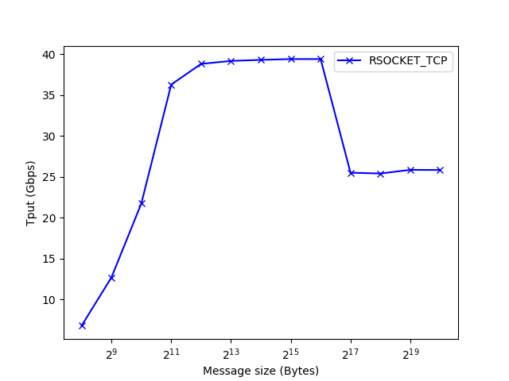

## Understanding Rsocket

理解 rsocket，我们从两方面入手，第一个是理解 rsocket 所提供接口的兼容性，第二个是通过一些 benchmarks 得出其性能。

## Rsocket internals

TODO

## Benchmarking rsocket

### Setup

- Two nodes and each equipped with one Mellanox ConnectX-3. Details:

```
$ ofed_info -s
MLNX_OFED_LINUX-4.0-2.0.0.1:

$ lshw -businfo -c network
Bus info          Device           Class       Description
==========================================================
pci@0000:01:00.0  ib0              network     MT27500 Family [ConnectX-3]

$ ibstatus
Infiniband device 'mlx4_0' port 1 status:
	default gid:	 fe80:0000:0000:0000:e41d:2d03:00e4:d711
	base lid:	 0x1
	sm lid:		 0x1
	state:		 4: ACTIVE
	phys state:	 5: LinkUp
	rate:		 40 Gb/sec (4X FDR10)
	link_layer:	 InfiniBand

Infiniband device 'mlx4_0' port 2 status:
	default gid:	 fe80:0000:0000:0000:e41d:2d03:00e4:d712
	base lid:	 0x0
	sm lid:		 0x0
	state:		 1: DOWN
	phys state:	 2: Polling
	rate:		 10 Gb/sec (4X)
	link_layer:	 InfiniBand
```

### Micro-benchmarks

对于 Socket-to-Verbs 转换库的测试，包含 throughout 和 latency。对于 latency，只关注小包的延迟即 payload 为 1 字节的延迟。

#### Round-trip latency

```
# @server
# -f 	Do not spawn chilren for each test, run serially.
# -D 	Do not daemonize.
# -L name,family Use name to pick listen addr and family for family.
# -4	Do IPv4.
$ NETSERVER=netserver -D -f -L 192.168.10.141 -4
$ LD_PRELOAD=/usr/lib/rsocket/librspreload.so $NETSERVER

# @client
$ NETPERF=netperf -t TCP_RR -H 192.168.10.141 -T 2 -l 30
$ LD_PRELOAD=/usr/lib/rsocket/librspreload.so $NETPERF
Local /Remote
Socket Size   Request  Resp.   Elapsed  Trans.
Send   Recv   Size     Size    Time     Rate         
bytes  Bytes  bytes    bytes   secs.    per sec   

131072 131072 1        1       30.00    526436.72   
131072 131072
```

由此可得 RTT 为 1.9 us。

#### Throughput

```
# @server
$ NETSERVER=netserver -D -f -L 192.168.10.141 -4
$ LD_PRELOAD=/usr/lib/rsocket/librspreload.so $NETSERVER

# @client
$ NETPERF=netperf -t TCP_STREAM -f g -H 192.168.10.141 -T 2 -l 10
$ LD_PRELOAD=/usr/lib/rsocket/librspreload.so $NETPERF -- -m $msg_size
```



由图，rsocket 上一条 TCP 连接在消息大小为 4KB 时达到 peak throughput，即 39.4 Gbps。图中有两个问题需要解决，一是数据传输时的瓶颈在哪里？二是消息超过 64KB 时，throughput 为什么会从 peak throughput 降到 25.8 Gbps？

针对以上两个问题，我们分别对 msg_size 为 1KB、64KB 和 1MB 时，给出 netperf 在 client 端的 breakdown。

```
$ perf report -g none --stdio --no-children  --sort symbol -n -i \
	perf_netperf_tcpstrm_1KB.data 
# To display the perf.data header info, please use --header/--header-only options.
#
#
# Total Lost Samples: 0
#
# Samples: 998  of event 'cycles'
# Event count (approx.): 22918604620
#
# Overhead       Samples  Symbol                     
# ........  ............  ...........................
#
    28.45%           282  [.] fastlock_release       
    18.15%           181  [.] __memcpy_sse2_unaligned
     6.16%            61  [.] mlx4_poll_cq           
     5.99%            60  [.] rsend                  
     5.86%            58  [.] mlx4_post_send         
     4.66%            47  [.] pthread_spin_lock      
     4.14%            41  [.] rs_write_data          
     3.44%            34  [.] post_send_rc_uc        
     3.23%            32  [.] ibv_post_send          
     2.83%            28  [.] fastlock_acquire       
     1.92%            19  [.] rs_post_write_msg      
     1.72%            17  [.] mlx4_bf_copy           
     1.52%            15  [.] send_omni_inner        
     1.31%            13  [.] rs_sbuf_left           
     1.22%            12  [.] send_data              
     1.21%            12  [.] idm_lookup             
     1.11%            11  [.] rs_can_send            
     1.11%            11  [.] fd_fork_get            
     1.01%            10  [.] send                   
     0.80%             8  [.] ibv_poll_cq            
     0.71%             7  [.] rs_poll_cq             
     0.71%             7  [.] idm_at                 
     0.71%             7  [.] idm_at 
     
$ perf report -g none --stdio --no-children  --sort symbol -n -i \
	perf_netperf_tcpstrm_64KB.data 
# To display the perf.data header info, please use --header/--header-only options.
#
#
# Total Lost Samples: 0
#
# Samples: 990  of event 'cycles'
# Event count (approx.): 22871310100
#
# Overhead       Samples  Symbol                     
# ........  ............  ...........................
#
    43.56%           430  [.] __memcpy_sse2_unaligned
     8.41%            83  [.] __vdso_gettimeofday    
     5.83%            57  [.] pthread_spin_lock      
     5.26%            52  [.] mlx4_poll_cq           
     4.87%            48  [.] rs_get_comp            
     4.75%            47  [.] fastlock_release       
     3.79%            37  [.] fastlock_acquire       
     3.63%            35  [.] rs_give_credits        
     3.03%            30  [.] get_sw_cqe             
     2.33%            23  [.] rs_process_cq          
     2.02%            20  [.] rs_poll_cq             
     1.42%            14  [.] rs_conn_can_send       
     1.31%            13  [.] rs_update_credits      
     1.31%            13  [.] mlx4_post_send         
     1.22%            12  [.] rs_can_send            
     0.91%             9  [.] ibv_poll_cq            
     0.71%             7  [.] ERR                    
     0.51%             5  [.] ibv_post_send          
     0.50%             5  [.] mlx4_find_qp
     
$ perf report -g none --stdio --no-children  --sort symbol -n -i \			
	perf_netperf_tcpstrm_1MB.data 
# To display the perf.data header info, please use --header/--header-only options.
#
#
# Total Lost Samples: 0
#
# Samples: 705  of event 'cycles'
# Event count (approx.): 14993826548
#
# Overhead       Samples  Symbol                              
# ........  ............  ....................................
#
    45.55%           325  [.] __memcpy_sse2_unaligned         
     5.01%            36  [.] __vdso_gettimeofday             
     4.80%            35  [.] pthread_spin_lock               
     4.56%            33  [.] fastlock_acquire                
     3.59%            25  [.] fastlock_release                
     2.95%             1  [.] allocate_buffer_ring            
     2.91%            21  [.] mlx4_poll_cq                    
     2.05%            14  [.] rs_get_comp                     
     1.97%            14  [.] rs_process_cq                   
     1.69%            12  [.] rs_give_credits                 
     1.43%            10  [k] ib_uverbs_event_read            
     1.28%             9  [.] rs_poll_cq                      
     1.13%             9  [k] update_curr                     
     1.11%             8  [.] get_sw_cqe                      
     1.11%             8  [k] update_cfs_shares               
     0.99%             7  [.] rs_update_credits               
     0.98%             7  [.] rs_conn_can_send                
     0.97%             7  [k] __schedule                      
     0.88%             7  [.] rs_can_send                     
     0.82%             6  [k] dequeue_entity                  
     0.73%             5  [k] entry_SYSCALL_64_fastpath       
     0.71%             5  [k] cpuacct_charge                  
     0.67%             5  [k] prepare_to_wait_event           
     0.62%             5  [.] rsend                           
     0.58%             4  [.] mlx4_post_send                  
     0.55%             4  [k] _raw_spin_lock_irqsave
```

Rsocket 单 TCP 流的主要开销来自数据拷贝（memcpy）和若干锁开销（fastlock_acquire/release、pthread_spin_lock）。具体原因有待分析，即通过通过阅读源码并了解程序逻辑的基础上给出分析。

关于第二个问题，通过 breakdown 发现，当 msg_size 大于 64KB 时，内核开销增大，由 64 KB 中的 0.11% 增大到 13.53%。至于为什么？有待通过分析源码理解。通过 breakdown，我们可以看到陷于内核主要进行 ib_uverbs_event_read。同时，相比 CPU2，CPU0 的中断数量很大，这中间有一定关联，需要结合分析。

```
$ perf report -g none --stdio --no-children --sort dso -n -i \
	perf_netperf_tcpstrm_64KB.data
# To display the perf.data header info, please use --header/--header-only options.
#
#
# Total Lost Samples: 0
#
# Samples: 990  of event 'cycles'
# Event count (approx.): 22871310100
#
# Overhead       Samples  Shared Object        
# ........  ............  .....................
#
    43.66%           431  libc-2.19.so         
    29.60%           291  librdmacm.so.1.0.0   
    11.73%           116  libmlx4-rdmav2.so    
     8.41%            83  [vdso]               
     5.83%            57  libpthread-2.19.so   
     0.40%             4  netperf              
     0.20%             2  librspreload.so.1.0.0
     0.11%             5  [kernel.kallsyms]    
     0.06%             1  ld-2.19.so 
     
$ perf report -g none --stdio --no-children --sort dso -n -i \
	perf_netperf_tcpstrm_1MB.data
# To display the perf.data header info, please use --header/--header-only options.
#
#
# Total Lost Samples: 0
#
# Samples: 705  of event 'cycles'
# Event count (approx.): 14993826548
#
# Overhead       Samples  Shared Object        
# ........  ............  .....................
#
    45.68%           326  libc-2.19.so         
    20.45%           147  librdmacm.so.1.0.0   
    13.63%           107  [kernel.kallsyms]    
     6.42%            46  libmlx4-rdmav2.so    
     5.08%            37  libpthread-2.19.so   
     5.01%            36  [vdso]               
     3.09%             2  netperf              
     0.33%             2  libibverbs.so.1.0.0  
     0.31%             2  librspreload.so.1.0.0
```

### Application-specific benchmarks

TODO

## Appendix

### Adapt RNIC's IRQ affinity

```bash
# Show concerned interrupt statistics
cat /proc/interrups | grep mlx4
# Show interrupt statistics in real time and also CPU utilization
mpstat -I SUM -u 1
```

Refs:

- What is IRQ Affinity?. https://community.mellanox.com/s/article/what-is-irq-affinity-x.

